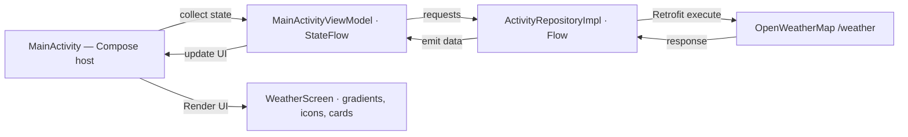

# 🌦️ Weather Compose (Android, Jetpack Compose)

A compact Android weather app rewritten with **Jetpack Compose** to showcase my **UI-first** approach, clean state management, and simple MVVM wiring.  
It fetches current weather by **device location** or **city name** and renders a **fully Compose** UI (Material 3) with **dynamic gradient backgrounds** and icon mapping per weather condition.

> 🕐 This repository reflects my Compose style from that time and is intentionally kept “as‑is”.

---

## ✨ Features

- Pure **Jetpack Compose** UI (Material 3 `SearchBar`, `Card`, etc.)
- Weather by **GPS** (FusedLocationProviderClient) or **City name**
- Key metrics: temperature (°C/°F), feels like, pressure, humidity, wind, sunrise/sunset, country & city
- **Dynamic UI**:
  - Gradient **backgrounds** via `Brush` chosen by `weather[0].id`
  - Weather **icons** mapped by condition id
- **State-driven UI** using `StateFlow` and a sealed `BaseState`

---

## 🧱 Tech Stack

- **Kotlin**, **Jetpack Compose**, **Material 3**
- **Coroutines + Flow**
- **Retrofit** + **GsonConverterFactory**
- **Google Play Services Location** (Fused Location)
- **EasyPermissions** (runtime permissions)

---

## 🗺️ Architecture (simple MVVM)

```
MainActivity (Compose host)
        ↓
MainActivityViewModel (StateFlow<BaseState>)
        ↓
ActivityRepositoryImpl (Flow<WeatherData>)
        ↓
Retrofit ApiInterface → OpenWeatherMap /weather
```

### Base State
```kotlin
@Parcelize
sealed class BaseState : Parcelable {
    object Working : BaseState()
    object Loading : BaseState()
    class Success(val weatherData: WeatherData) : BaseState()
    class Error(val message: String) : BaseState()
}
```

---

## 🧩 UI Structure (Compose)

- **`WeatherScreen`** — top-level screen that applies the gradient background and stacks sections:
  - `SearchView()` — Material 3 `SearchBar` with history list, location button, and city search
  - `CurrentWeather()` — city, date, min/max, big temperature, icon, short condition
  - `DescriptionWeather()` — metrics cards (pressure, humidity, wind, sunrise/sunset, °F, ground/sea level, country)
- **Dynamic visuals** via helpers:
  - `setBackground(id: Int): Brush` — maps condition to gradient (`Thunderstorm_b`, `Drizzle_b`, `Rain_b`, `Snow_b`, `Atmosphere_b`, `Clear_b`, `Clouds_b`, `Unknown_b`)
  - `setIcon(id: Int): Int` — maps condition to drawable icon

> Date/time formatting uses `Constants.DATE_PATTERN` / `TIME_PATTERN`. Temperatures convert from Kelvin in helpers (historical behavior preserved).

---

## 📦 Packages & Files

```
app/
 └─ src/main/
     ├─ AndroidManifest.xml
     ├─ java/com/crazycats/weathercompose/
     │   ├─ activity/
     │   │   ├─ MainActivity.kt
     │   │   ├─ MainActivityViewModel.kt
     │   │   └─ domain/
     │   │       ├─ ActivityRepository.kt
     │   │       └─ ActivityRepositoryImpl.kt
     │   ├─ activity/presentation/
     │   │   └─ BaseState.kt
     │   ├─ model/               // WeatherData + nested models
     │   ├─ screens/
     │   │   ├─ WeatherScreen.kt
     │   │   └─ (helpers: setBackground, setIcon, conversions, sunTime)
     │   ├─ ui/
     │   │   ├─ Constants.kt
     │   │   ├─ delegate/        // viewModelCreator (Compose host)
     │   │   └─ theme/           // gradient brushes (Thunderstorm_b, etc.)
     │   └─ utilites/
     │       ├─ ApiInterface.kt
     │       ├─ ApiUtilities.kt
     │       └─ TrackingUtility.kt
     └─ res/ (drawables, strings, etc.)
```

---

## 🔌 API

- **Base URL:** `https://api.openweathermap.org/data/2.5/`
- **Endpoints:**
  - `/weather?lat={lat}&lon={lon}&APPID={key}`
  - `/weather?q={city}&APPID={key}`

> Put your API key in `ui/Constants.kt` → `API_KEY` (do **not** commit a real key).  
> The project keeps manual Kelvin → Celsius/°F conversion to mirror the original approach.

---

## 📲 Permissions

Declared in `AndroidManifest.xml`:
- `INTERNET`
- `ACCESS_COARSE_LOCATION`
- `ACCESS_FINE_LOCATION`
- `ACCESS_BACKGROUND_LOCATION` *(legacy; only needed for background tracking)*

Runtime flow uses **EasyPermissions** with fallback to App Settings when denied.

---

## 🔄 Data Flow



---

## ▶️ How to Run

1. Add your OpenWeatherMap API key:
   ```kotlin
   const val API_KEY = "YOUR_KEY"
   ```
2. Build & run on a device/emulator with location enabled.
3. Grant location permissions when prompted.
